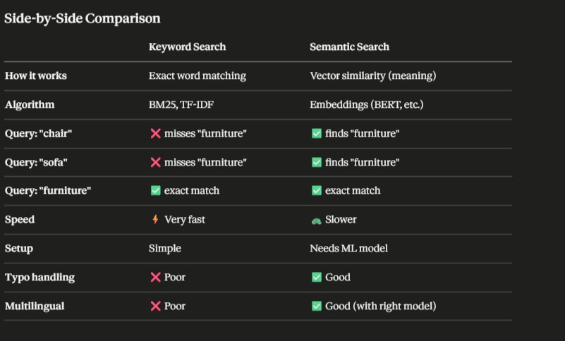
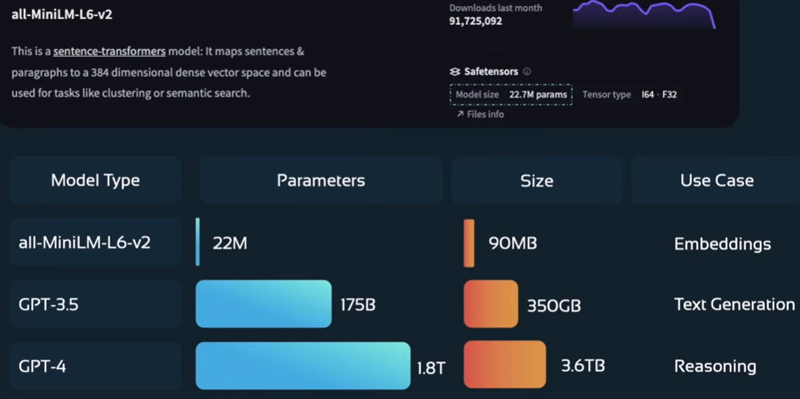
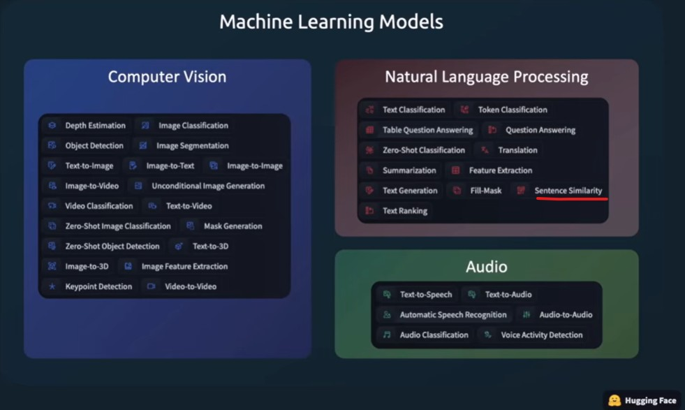

## Keyword Search vs Semantic Search
### Keyword Search (BM25 / TF-IDF)
Matches exact words between query and documents.
### Semantic Search (Embeddings)
Matches meaning even without exact word overlap.
 
 
